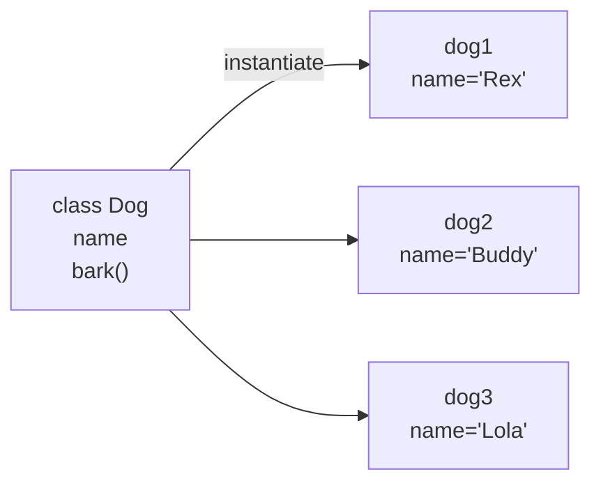
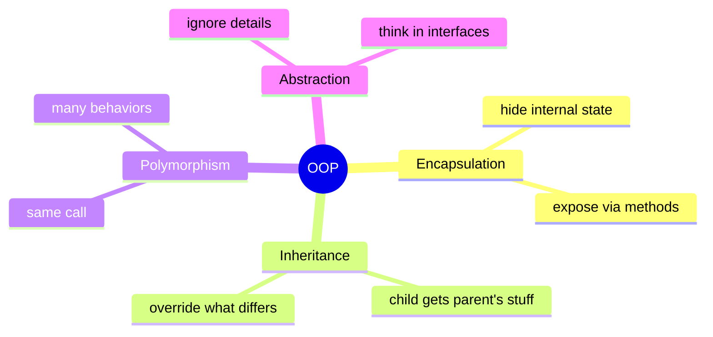

Separate data and procedures.
-state is part of the object

Objects--> have methods


Class is a template --> instantiate --> object(S)

```
class something():
	def __init__(self, assign):
		self.attribute= assign
	def method(self):
		DO SOMETHING 
		
x = something(data)
x.method()
```


[[Polymorphism]]

## Visual - class to object



## Visual - the four pillars



## Learn more
- Wikipedia: [OOP](https://en.wikipedia.org/wiki/Object-oriented_programming)
- [Real Python: OOP in Python](https://realpython.com/python3-object-oriented-programming/)
- See [[Polymorphism]], [[Duck Typing]]
