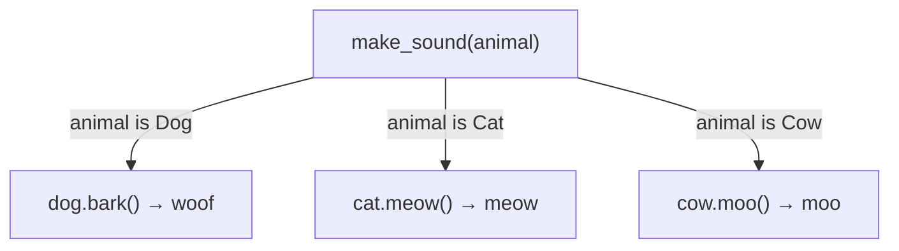
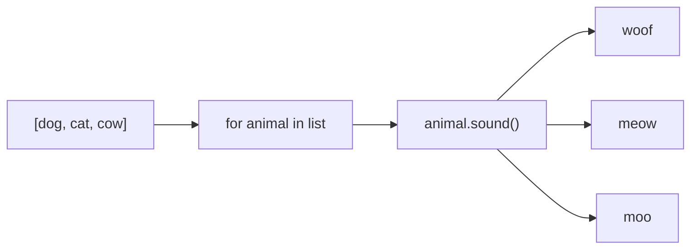

Same inference but different behavior, 

Duck typing: 
- if it walks like a duck, it quacks like a duck then it must be a duck
- Dynamic type checking

If two objects have the same methods, you can pool them together and call the method of the shared function

## Visual

Same function call. Different behavior depending on the object.

## Visual - mixed list

## Learn more
- Wikipedia: [Polymorphism (computer science)](https://en.wikipedia.org/wiki/Polymorphism_(computer_science))
- See [[Object-Oriented Programming]], [[Duck Typing]]

