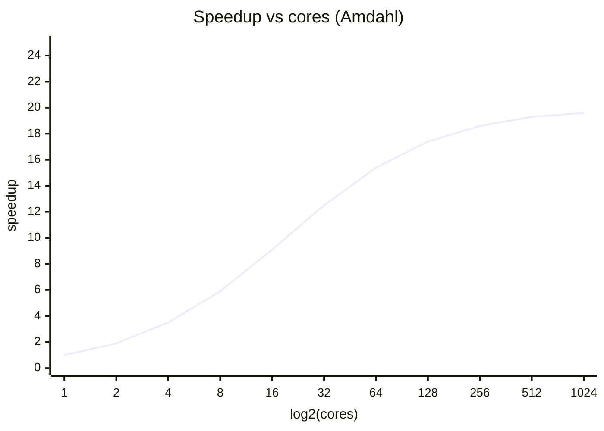
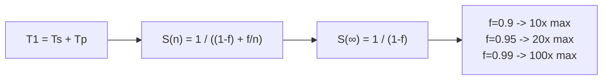

Gene Amdahl, 1967. The pessimistic upper bound on parallel speedup. Tells you why throwing infinite cores at a job rarely pays.

```
   sequential part      parallelizable part
   ┌──┬──────────────────────────────────────┐  1 core
   │S │              P                       │
   └──┴──────────────────────────────────────┘
   ┌──┬────────────────────┐                    2 cores
   │S │       P / 2        │
   └──┴────────────────────┘
   ┌──┬──────────┐                              4 cores
   │S │  P / 4   │
   └──┴──────────┘
   ┌──┐                                         ∞ cores
   │S │
   └──┘
   ◄── always pays the sequential cost
```

## The law
- `T1` = runtime on 1 CPU.
- `T1 = Ts + Tp` (serial + parallel parts).
- `f = Tp / T1` = fraction that CAN be parallelized, `0 ≤ f ≤ 1`.
- Runtime on n CPUs: `Tn(n) = (1 - f) * T1 + (f / n) * T1`.
- Speedup: `S(n) = 1 / ((1 - f) + f/n)`.
- Ceiling as `n -> ∞`: `S(∞) = 1 / (1 - f)`.

## Worked examples
| f (parallel fraction) | S(10) | S(∞) ceiling |
|---|---|---|
| 0.50 | 1.82 | 2 |
| 0.90 | 5.26 | 10 |
| 0.95 | 6.90 | 20 |
| 0.99 | 9.17 | 100 |
| 0.999 | 9.91 | 1000 |

! f = 0.95 already locks you to 20x max. Even with 10,000 cores. The serial 5% dominates.

## Embarrassingly parallel
- problems where `f ≈ 1`. Little to no communication between tasks.
- examples: rendering frames, k-fold cross validation, grid search hyperparams, random forest tree growth, serving static files, climate scenario sims.
- these scale near-linearly with cores. Amdahl is almost flat for them.

## Where Amdahl is too pessimistic
- assumes problem size FIXED while cores grow.
- in reality, bigger machines run bigger problems. See [[Gustafson's Law]].
- assumes serial fraction is independent of n. Often false (more processors = different algorithm).

## Visual


f = 0.95. Ceiling at 20. Diminishing returns are brutal.



vs [[Gustafson's Law]] - the optimistic counter from 1988.
Related: [[Parallel vs Distributed]], [[Scale Up vs Scale Out]].

## Learn more
- Amdahl 1967: *Validity of the single-processor approach to achieving large scale computing capabilities*. AFIPS Conference Proceedings, vol. 30.
- [Amdahl's Law (Wikipedia)](https://en.wikipedia.org/wiki/Amdahl%27s_law)
