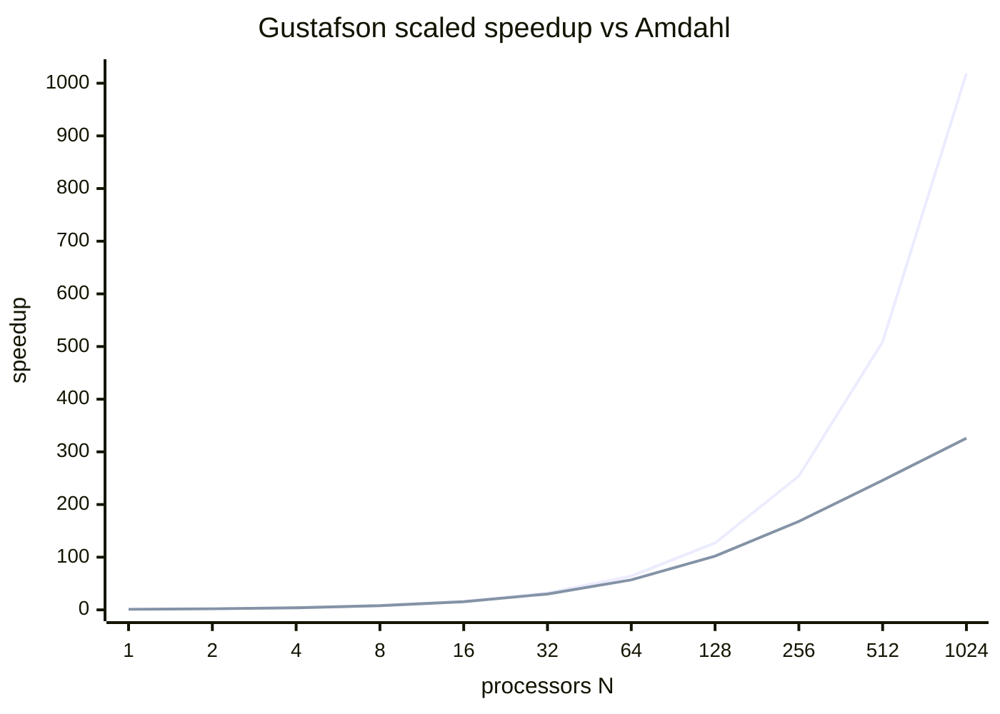
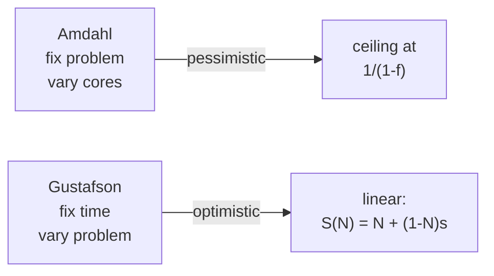

John Gustafson, 1988. The optimistic counter to [[Amdahl's Law]]. Achieved 1024x speedup on 1024 processors at Sandia, then explained why.

```
   AMDAHL                          GUSTAFSON
   fix the PROBLEM, vary cores     fix the TIME, vary problem

   ┌──┬─────┐                      ┌──┬──────────────────────────┐
   │S │ P/n │  shrink as n grows   │S │      P × n               │  grow as n grows
   └──┴─────┘                      └──┴──────────────────────────┘
   speedup ceiling = 1/(1-f)       speedup = N + (1 - N) × s
   curves                          linear with slope ~N
```

## The insight
- Amdahl assumes fixed problem size. Wrong in practice.
- "One does not take a fixed-sized problem and run it on various numbers of processors except when doing academic research".
- In reality: bigger machine = bigger problem. Users tune grid resolution, time steps, model size until run time is acceptable.
- So **time is constant, problem grows**.

## Scaled speedup
- `s` = time on serial part (on parallel machine).
- `p` = time on parallel part (on parallel machine).
- Normalize: `s + p = 1`.
- If you ran the SAME problem on 1 processor it would take `s + p * N`.
- Scaled speedup: `S(N) = s + p * N = N + (1 - N) * s`.
- Linear in N. Slope `1 - N`. Much friendlier than Amdahl's curve.

## Sandia results
| Application | Speedup on 1024 hypercube |
|---|---|
| Beam stress (conjugate gradients) | **1020** |
| Surface wave sim (finite differences) | **1020** |
| Unstable fluid flow (FCT) | **1016** |

Serial fractions `s = 0.004 to 0.008`. Amdahl would predict ~125 to 250x max. Reality: ~1020x.

! The "mental block" against massive parallelism is a misuse of Amdahl. Scale the problem with the processors, not the processors with the problem.

## When each law applies
- **Amdahl** = you have a fixed job, just want it done faster. Real time, latency.
- **Gustafson** = you have a fixed time budget, can do more work. Throughput, simulation, ML training.
- Big Data leans **Gustafson**. More data = more problem = the same wall-clock per job.

## Visual





vs [[Amdahl's Law]] - the pessimistic version Gustafson is reevaluating.
Related: [[Parallel vs Distributed]], [[Scale Up vs Scale Out]].

## Learn more
- Gustafson 1988: *Reevaluating Amdahl's Law*, Communications of the ACM 31(5). The 2-page paper that flipped the field.
- Benner, Gustafson, Montry 1988: *Development and analysis of scientific application programs on a 1024-processor hypercube*. Sandia SAND 88-0317.
- [Gustafson's Law (Wikipedia)](https://en.wikipedia.org/wiki/Gustafson%27s_law)
