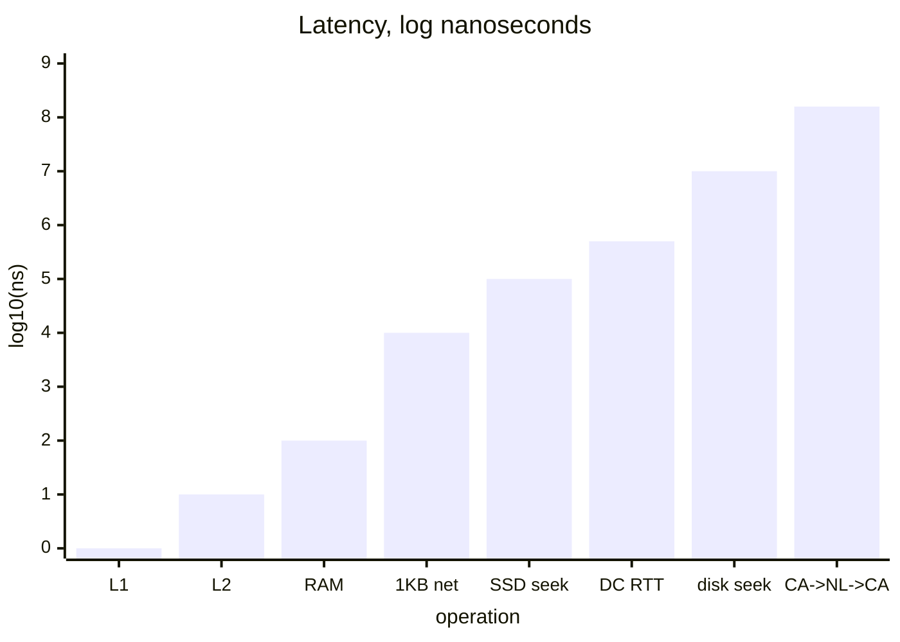

Jeff Dean's classic table. Tells you why network is expensive and why memory beats disk every time.

```
   L1 cache         ▏ 0.5 ns
   L2 cache         ▏ 7 ns               14x L1
   RAM              ▎ 100 ns             200x L1
   1 KB over net    ▍ 10,000 ns
   SSD seek         ▌ 100,000 ns         1000x RAM
   1 MB from RAM    ▌ 250,000 ns
   datacenter RTT   ▋ 500,000 ns         5x SSD seek
   1 MB from SSD    ▊ 1,000,000 ns       4x 1MB from RAM
   disk seek        ▉ 10,000,000 ns      20x datacenter RTT
   1 MB from disk   █ 20,000,000 ns
   CA -> NL -> CA   ████ 150,000,000 ns  speed of light, ~75ms each way
```

## The numbers
| Op | Time | Multiplier |
|---|---|---|
| L1 cache reference | 0.5 ns | 1x |
| L2 cache reference | 7 ns | 14x L1 |
| Main memory reference | 100 ns | 14x L2, 200x L1 |
| Send 1 KB over 1 Gbps net | 10,000 ns | |
| SSD seek | 100,000 ns | 1000x memory |
| Read 1 MB sequentially from memory | 250,000 ns | |
| Round trip within same datacenter | 500,000 ns | 5x SSD seek |
| Read 1 MB sequentially from SSD | 1,000,000 ns | 4x memory |
| Disk seek | 10,000,000 ns | 20x DC RTT |
| Read 1 MB sequentially from disk | 20,000,000 ns | 80x memory |
| Send packet CA -> NL -> CA | 150,000,000 ns | |

## The same, scaled by 10^9 (human time)
| Op | Real time | Human scale |
|---|---|---|
| L1 reference | 0.5 ns | 1 heartbeat |
| L2 reference | 7 ns | long yawn |
| RAM | 100 ns | brushing teeth |
| 2 KB over net | 5.5 hr | lunch -> end of day |
| SSD seek | 1.7 days | a weekend |
| 1 MB RAM read | 2.9 days | long weekend |
| Datacenter RTT | 5.8 days | medium vacation |
| 1 MB SSD | 11.6 days | waiting on a delivery |
| Disk seek | 16.5 weeks | one semester |
| 1 MB disk | 7.8 months | almost a baby |
| CA -> NL -> CA | 4.8 years | a bachelor's degree |

! The full disk hop costs you a baby. The network hop costs you a degree.

## So what
- **memory beats disk** by 100-1000x. This is why [[In-memory]] exists.
- **sequential beats random** by ~100x on SSD/disk. Why [[Columnar Database]] wins for analytics.
- **local beats network**. Why [[MPP]] and [[MapReduce]] push compute to the data, not data to the compute.
- **bandwidth grows faster than latency**. Light is the bottleneck for the last one.

## Visual



Related: [[Parallel vs Distributed]], [[MapReduce]], [[MPP]], [[In-memory]].

## Learn more
- Jeff Dean: [Latency Numbers Every Programmer Should Know](https://gist.github.com/jboner/2841832) - original
- [Interactive version](https://colin-scott.github.io/personal_website/research/interactive_latency.html) - shows how numbers evolved
