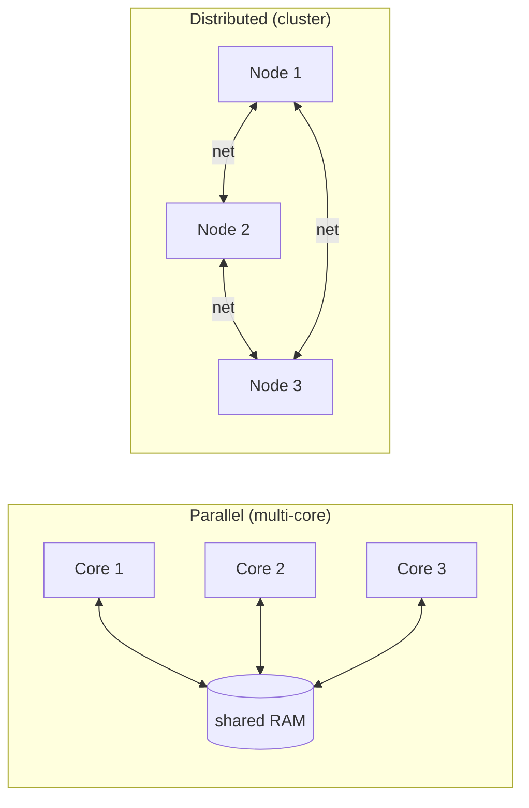

Two words people mix up. Both mean "more than one thing working at once". Difference is where they live.

```
   PARALLEL                          DISTRIBUTED
   one node, many workers            many nodes, one job

   ┌────────────────┐                ┌──────┐  ┌──────┐  ┌──────┐
   │   1 machine    │                │ node │  │ node │  │ node │
   │  ┌───┬───┬───┐ │                │  1   │  │  2   │  │  3   │
   │  │C1 │C2 │C3 │ │                └──┬───┘  └──┬───┘  └──┬───┘
   │  └───┴───┴───┘ │                   │         │         │
   └────────────────┘                   └─────────┴─────────┘
                                              network
```

## Idea
- **Parallel** = more than one Core, CPU, GPU, or Node on an algorithm at the same time.
- **Distributed** = more than one Node, connected over a network, on an algorithm at the same time.
- Opposite of parallel = **sequential**.
- Distributed is a kind of parallel. Parallel is broader.

## Why distribute COMPUTATION
- speedup via parallelism (see [[Amdahl's Law]])
- fault tolerance (one node dies, others keep going)
- lower latency (compute near user)

## Why distribute DATA
- single node runs out of disk
- put data near the compute
- replication = fault tolerance
- parallel reads = bandwidth multiplier

## Tradeoffs
- communication between nodes = slow (see [[Latency Numbers]])
- coordination = bugs (see [[Shared State]])
- writing parallel code is HARD. Sequential is the comfort zone.

## Visual



Related: [[Scale Up vs Scale Out]], [[Amdahl's Law]], [[MapReduce]], [[MPP]].

## Learn more
- Plattner + Zeier 2012, *In-Memory Data Management*. Source for the trend charts in lecture.
- [Latency numbers every programmer should know](https://gist.github.com/jboner/2841832)
