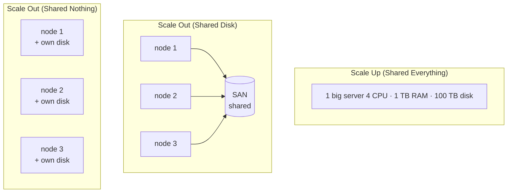

Two strategies to add capacity. Buy a bigger box, or buy more boxes.

```
   SCALE UP                     SCALE OUT
   bigger machine               more machines
   shared everything            shared disk OR shared nothing

   ┌──────────────────┐         ┌─────┐ ┌─────┐ ┌─────┐
   │   1 big server   │         │node │ │node │ │node │
   │ CPU CPU CPU CPU  │         │ +D  │ │ +D  │ │ +D  │
   │   shared RAM     │         └─────┘ └─────┘ └─────┘
   │   shared DISK    │            \      |      /
   └──────────────────┘             cheap commodity hw
   $$$$ vertical                   $    horizontal
```

## Three shared architectures
| Pattern | What is shared | Example |
|---|---|---|
| **Shared Everything** | RAM + DISK between all CPUs | classic SMP server, mainframe |
| **Shared Disk** | DISK between nodes (RAM is per-node) | Oracle RAC, SAN, NAS |
| **Shared Nothing** | nothing. Each node owns its CPU + RAM + DISK | Hadoop, Spark, [[MPP]], Snowflake, BigQuery |

! Big Data = shared nothing. Coordination is the bottleneck. Removing it is the trick.

## Scale Up
- one bigger box. More cores, more RAM, more disk.
- LIMITS: hardware ceiling, exponential cost curve, single point of failure.
- WINS: simple code, no network hop, low latency.

## Scale Out
- many small boxes connected by network.
- LIMITS: coordination, network as bottleneck, partial failures.
- WINS: linear-ish cost, fault tolerance, commodity hw, unlimited ceiling (in theory).

## Why hardware drove the shift
- single-core clock speed plateaued ~2005 (thermal wall).
- vendors went horizontal: more cores per chip.
- then more chips per box, then more boxes per cluster.
- software had to follow. [[MapReduce]], [[Hadoop]], [[MPP]] are all responses.

## Visual



vs [[MPP]] - the canonical shared nothing analytics architecture.
vs [[In-memory]] - typically scale up (one giant RAM pool).

## Learn more
- DeWitt + Gray 1992, *Parallel Database Systems: The Future of High Performance Database Systems*.
- [Shared Nothing Architecture (Wikipedia)](https://en.wikipedia.org/wiki/Shared-nothing_architecture)
