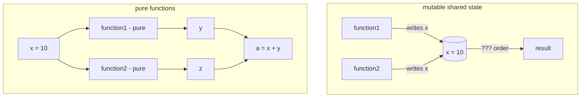

Why parallel programming is hard. The bug isn't in your logic, it's in the order things happened.

```
   sequential          parallel (bad)         parallel (good)
   x = 10              x = 10                 y = f1(10)   ◄── pure
   x = f1(x)           ┌─f1(x)─┐              z = f2(10)   ◄── pure
   x = f2(x)           │       │              a = 10 + y   ◄── no shared write
   x = x + 10          └─f2(x)─┘
                       race! who wins?
```

## The problem
```python
x = 10
x = function1(x)
x = function2(x)
x = x + 10
```
- value of `x` is **time-dependent**. Order matters.
- single process: fine. CPU executes top to bottom.
- multiple processes: undefined. function1 and function2 race.
- fix attempts: locks (slow, deadlock risk), pure functions (best), message passing.

## Locking
- one process holds a value, others wait.
- correct, but kills parallelism. Workers idle.
- nested locks = [[#Deadlock]].

## Deadlock
```
       Process 1
       /        \\
   waits for    holds
       │          │
       ▼          ▼
   Process 2  Process 3
       │          ▲
       └─ waits ──┘
```
- circular waiting. Each process holds what another wants.
- detection: cycle in the resource-allocation graph.
- prevention: order your locks, use timeouts, prefer pure functions.

## Pure functions = the way out
```python
x = 10
y = function1(x)   # pure, no side effects
z = function2(x)   # pure, no side effects
a = x + y
```
- step 2 and 3 can be parallelized iff `function1` and `function2` are PURE.
- pure means:
  - no side effects
  - no hidden internal state
  - output determined only by inputs

Same input always returns same output. No order dependence.

## Why this matters for Big Data
- [[MapReduce]] forces map and reduce to be PURE. That's why it scales.
- [[Stream Processing]] (Flink, Kafka Streams) builds on the same idea: stateless or carefully-managed state.
- functional paradigms (immutable data, pure fns) won not because purity is elegant, but because mutable shared state doesn't survive contact with 1024 cores.

! Race conditions don't show up in tests. They show up in production at 2am.

## Visual



Related: [[Parallel vs Distributed]], [[MapReduce]], [[Object-Oriented Programming]] (mutable state by default), [[Duck Typing]].

## Learn more
- [Dijkstra 1965, *Cooperating Sequential Processes*](https://www.cs.utexas.edu/users/EWD/transcriptions/EWD01xx/EWD123.html) - founding paper on concurrency primitives.
- [Coffman et al 1971, *System Deadlocks*](https://dl.acm.org/doi/10.1145/356586.356588) - the 4 necessary conditions.
