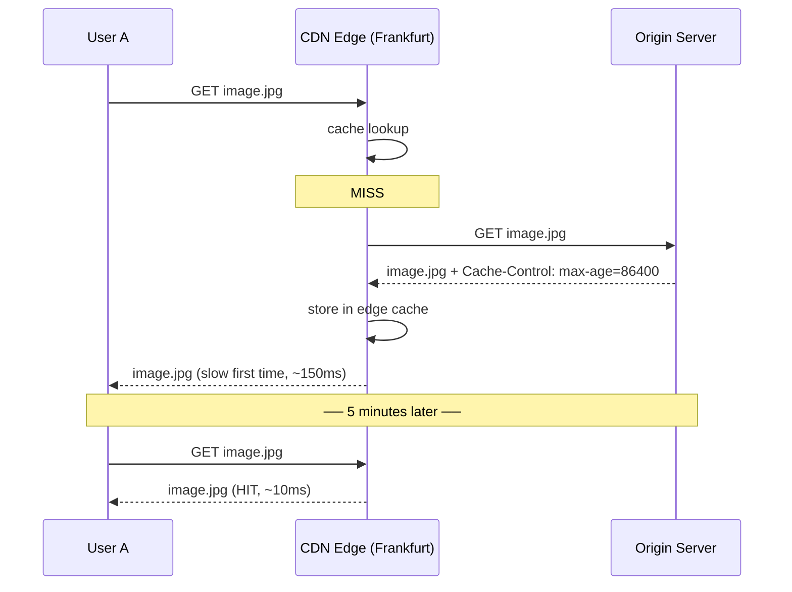
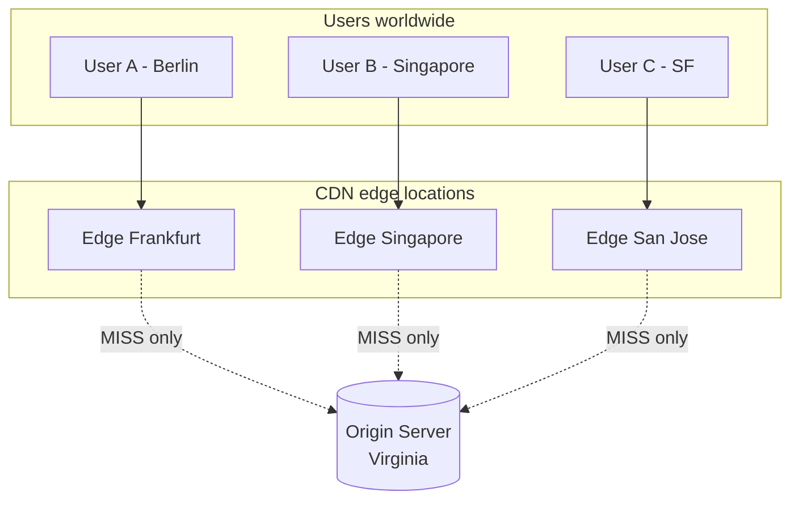

A network of servers spread around the world that cache your static files near your users. Cuts latency, cuts origin load.

```
              CDN edges (close to users)
   ┌─────┐                 ┌────┐ Frankfurt
   │ User│ ──► get img ──► │CDN │ ──► (HIT) returns image, ~10ms
   │  A  │                 └────┘
   └─────┘                    │ (MISS first time)
                              ▼
                         ┌────────┐
                         │ Origin │ in Virginia, ~120ms RTT
                         │ server │
                         └────────┘
   ┌─────┐                 ┌────┐ Singapore
   │ User│ ──► get img ──► │CDN │ ──► (HIT) returns image, ~5ms
   │  B  │                 └────┘
   └─────┘
```

## Why
- **lower latency**: edge is geographically near the user (see [[Latency Numbers]]: CA -> NL = 150 ms).
- **lower origin load**: edge absorbs reads, origin handles writes + cache fills.
- **higher availability**: origin can be down while edges serve cached copies.
- **cheaper bandwidth**: CDNs negotiate peering deals you can't.

## What gets cached
- "static assets": images, videos, CSS, JS, static HTML.
- modern CDNs also cache dynamic responses with smart rules (key by cookie, query, geo).
- not for: user-specific dashboards, anything personalised by default.

## Providers
- Cloudflare
- Akamai (the OG, 1998)
- Amazon CloudFront
- Google Cloud CDN
- Fastly
- BunnyCDN

## Cache miss flow


## Cache controls (origin tells the CDN)
- `Cache-Control: public, max-age=86400` -> cache 1 day everywhere
- `Cache-Control: private` -> don't cache at shared CDN, only browser
- `Cache-Control: no-store` -> never cache
- `ETag: "abc123"` -> versioned response, browser revalidates

## Cache busting
- when the asset changes, change the URL.
- common trick: `style.abc123.css` where the hash = file content.
- new content = new URL = no stale cache.

## Visual



Related: [[Cache]], [[HTTP]], [[Load Balancer]], [[Latency Numbers]], [[DNS and URL]].

## Learn more
- [How CDNs work (Cloudflare)](https://www.cloudflare.com/learning/cdn/what-is-a-cdn/)
- [Akamai history](https://en.wikipedia.org/wiki/Akamai_Technologies)
- [HTTP caching (MDN)](https://developer.mozilla.org/en-US/docs/Web/HTTP/Caching)
