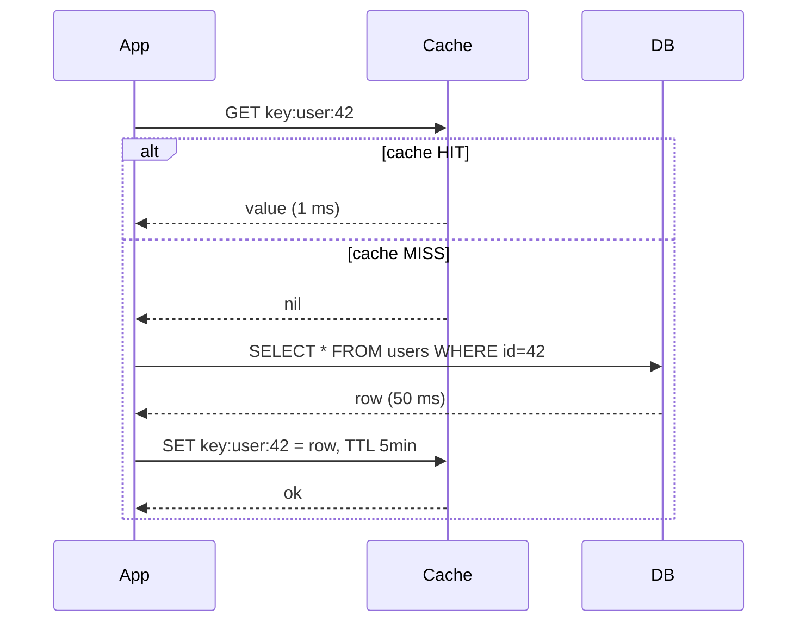
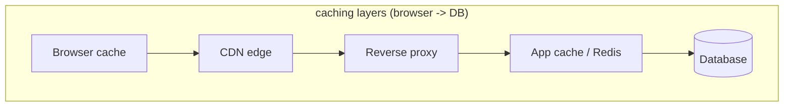

Store the answer so you don't have to compute it again. Single biggest performance lever in web systems.

```
   without cache                   with cache
   browser ──► server              browser ──► server
                  │                              │
                  │ heavy query                  │  ┌─ HIT ─► return ◄── fast
                  ▼                              ▼  │
              database                        cache ┤
              (slow)                                │
                                                   └─ MISS ──► database ──► fill cache
```

## Why
- save expensive computations.
- save round trips to slow stores (disk, network, DB).
- example: front page of New York Times. Rendering once, serving millions.

! Two hard problems in computer science: cache invalidation, naming things, and off-by-1 errors. (Leon Bambrick)

## Where caches live
| Layer | Tool | What it caches |
|---|---|---|
| Browser | built-in HTTP cache | static assets, GET responses |
| [[CDN]] | Cloudflare, Akamai | static files, edge-cached pages |
| Reverse proxy | NGINX, Varnish | full HTML responses |
| App | Memcached, Redis | DB rows, computed results, sessions |
| DB | query cache, buffer pool | rows, index pages |
| CPU | L1/L2/L3 | recently-used memory ([[Latency Numbers]]) |

## Caching systems
- **Memcached** - simple in-memory KV. No persistence, no data types.
- **Redis** - in-memory KV + lists, sets, hashes, streams, pub/sub. Optional persistence.
- **Cassandra** - wide-column store, sometimes used as a fat cache layer.

## Cache patterns
- **Read-through** - app asks cache. Miss = cache fetches from DB, fills itself.
- **Write-through** - app writes, cache writes to DB synchronously.
- **Write-behind** - app writes to cache, cache flushes to DB async.
- **Cache-aside** - app handles miss + fill itself. Most common.

```
   CACHE-ASIDE
   app:   value = cache.get(k)
          if value is None:
              value = db.get(k)
              cache.set(k, value, ttl)
          return value
```

## The hard part = invalidation
- when does cached data become wrong?
- strategies:
  - **TTL** (time to live) - expire after N seconds. Simple, but stale window.
  - **Write-through** - update cache on write. Cache always fresh, slower writes.
  - **Event-driven** - publish "key X changed", subscribers evict.
  - **Versioned keys** - never invalidate, just write new key. Old garbage-collects.

## Visual





Related: [[HTTP]], [[CDN]], [[Load Balancer]], [[Latency Numbers]].

## Learn more
- [Caching strategies (AWS)](https://aws.amazon.com/caching/best-practices/)
- [Redis docs](https://redis.io/docs/)
- [Memcached wiki](https://github.com/memcached/memcached/wiki)
