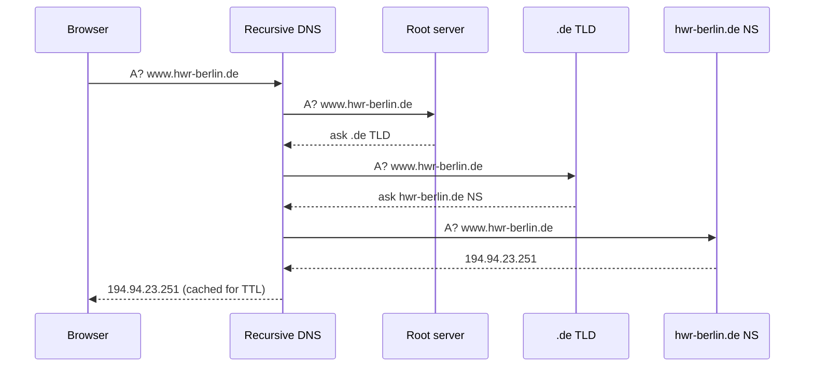

How humans name servers, and how browsers translate names into IP addresses.

```
   Browser asks:  www.hwr-berlin.de ?
        │
        ▼
   ┌────────────┐    "translate"    ┌────────────┐
   │   Browser  │ ────────────────► │ DNS Server │
   └────────────┘                   └────────────┘
        ▲                                  │
        │       194.94.23.251              │
        └──────────────────────────────────┘
        │
        ▼
   Browser opens TCP to 194.94.23.251:443
```

## DNS in one paragraph
- domain names are for humans. IPs are for routers.
- DNS is the directory. You ask "what's the IP for `www.hwr-berlin.de`?", server answers `194.94.23.251`.
- runs over UDP port 53 (sometimes TCP).
- distributed, hierarchical. No single DNS server has the whole map.

## Domain anatomy
```
   zeno . lehre . hwr-berlin . de
    │      │         │         │
    │      │         │         └── Top-Level Domain (TLD)
    │      │         └──────────── Domain name (second level, what you register)
    │      └────────────────────── Subdomain (third level)
    └───────────────────────────── Subdomain (fourth level)
```

! "Root domain" = what you registered. Everything to the left, you control.

## URL anatomy
- **U**niform **R**esource **L**ocator. Web address.

```
   https :// www.hwr-berlin.de /search/ ?mksearch[term]=BIPM
     │            │                │              │
   Protocol     Domain           Path        Query parameters
```

| Part | Example | Meaning |
|---|---|---|
| Protocol | `https://` | how to talk |
| Domain | `www.hwr-berlin.de` | who to talk to |
| Path | `/search/` | what to ask for |
| Query | `?key=value&...` | extra arguments |

## DNS resolution flow


## Why care for system design
- DNS = single point of indirection. Change the record, traffic moves. Powers blue/green deploys, [[Load Balancer\|DNS load balancing]], failover.
- TTL = how long a resolver caches. Short TTL = fast failover, more queries.
- DNS hijack / spoof = whole site goes elsewhere. Use DNSSEC, HTTPS to defend.

Related: [[Internet Protocol Stack]], [[HTTP]], [[Load Balancer]], [[CDN]].

## Learn more
- [RFC 1034 / 1035](https://datatracker.ietf.org/doc/html/rfc1034) - original DNS spec
- [How DNS works (Cloudflare)](https://www.cloudflare.com/learning/dns/what-is-dns/)
- [URL spec, WHATWG](https://url.spec.whatwg.org/)
