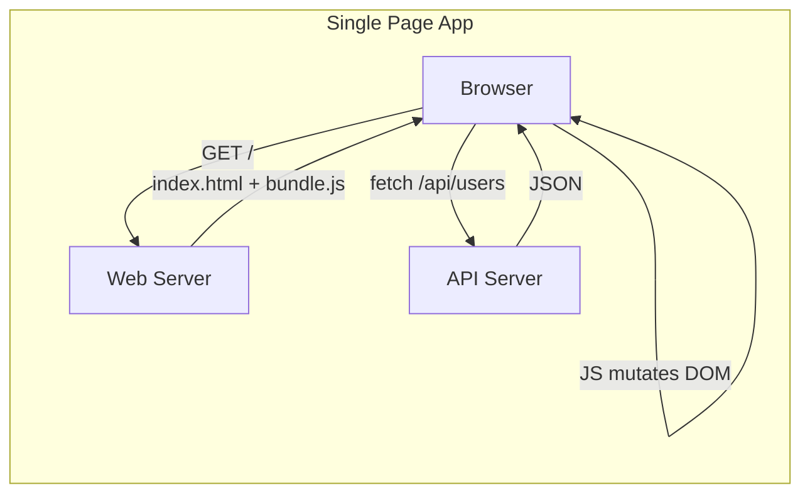
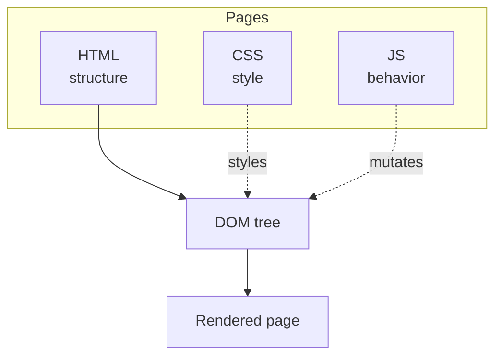

What runs in the user's browser (or phone). HTML for structure, CSS for looks, JS for behavior.

```
   ┌────────────────────────────────────────┐
   │  HTML  =  structure   (tags, content)  │
   ├────────────────────────────────────────┤
   │  CSS   =  presentation (colors, layout)│
   ├────────────────────────────────────────┤
   │  JS    =  behavior     (interactivity) │
   └────────────────────────────────────────┘
              │
              ▼
         DOM (Document Object Model)
         = tree of HTML elements, scriptable
```

## JavaScript in one paragraph
- programming language. Imperative + OO + functional. Weakly typed. Curly braces.
- runs in any browser. Also on the server via Node.js.
- can change a page without reloading: combo of HTML + CSS + JS.

## The DOM
- **D**ocument **O**bject **M**odel.
- in-memory tree representing the HTML.
- browser exposes APIs to read, modify, attach event handlers.
- click a button -> handler fires -> JS mutates DOM -> page changes.

```
   <html>
     ├── <head>
     │     └── <title>
     └── <body>
           ├── <h1>
           └── <div id="app">
                 ├── <button>
                 └── <ul>
                       ├── <li>
                       └── <li>
```

## Single-Page Application (SPA)
- one HTML page loads once.
- JS takes over routing, calls APIs, rewrites the DOM.
- communication with backend = JSON over HTTP (see [[HTTP]]).

```
   classic page nav             SPA
   ────────────────             ───
   click link                   click link
   → server returns full HTML   → JS intercepts
   → browser reloads            → fetch /api/page
   → flash, lose state          → JSON in
                                → JS rewrites DOM
                                → no reload, state kept
```

| Pro | Con |
|---|---|
| no full page reload | bigger initial JS bundle |
| feels like native app | SEO harder (page is empty until JS runs) |
| client-side routing | more complex codebase |
| reusable API for mobile too | first paint slower |

## Frontend frameworks
- **React** (Meta) - components, virtual DOM, hooks
- **Vue** - approachable, single-file components
- **Svelte** - compiles to vanilla JS, no runtime
- **Angular** (Google) - opinionated, TypeScript-first

## Python -> JS visualization libraries
For data dashboards without writing JS:
- **Altair** - grammar of graphics, declarative
- **Bokeh** - interactive plots, server option
- **Plotly Express** - quick interactive charts
- **Plotly Dash** - full dashboards
- **Panel** - tie widgets to any plot library
- **Streamlit, marimo** - notebook-style apps

! Same idea: Python emits JSON/JS, browser renders. You stay in your language.

## Mobile apps
| Kind | Built with | Pros | Cons |
|---|---|---|---|
| **Native** | iOS: Swift / ObjC. Android: Kotlin / Java | full hw access, fastest, offline | 2 codebases |
| **Hybrid / cross-platform** | React Native, Flutter, Svelte Native, NativeScript, Cordova | one codebase, near-native UX | some hw limits |
| **Web app** | HTML + CSS + JS | share via URL, no install | limited offline, no app store |

Native + hybrid distribute through App Store / Play Store. Web apps live at a URL.

All three talk to backend via Web APIs and JSON.

## Visual





Related: [[HTTP]], [[Web Architecture]], [[Cache]], [[CDN]].

## Learn more
- [MDN Web Docs](https://developer.mozilla.org/) - canonical reference
- [Eloquent JavaScript (free book)](https://eloquentjavascript.net/)
- [React docs](https://react.dev/)
- [Streamlit](https://streamlit.io/), [marimo](https://marimo.io/) - Python -> web app
