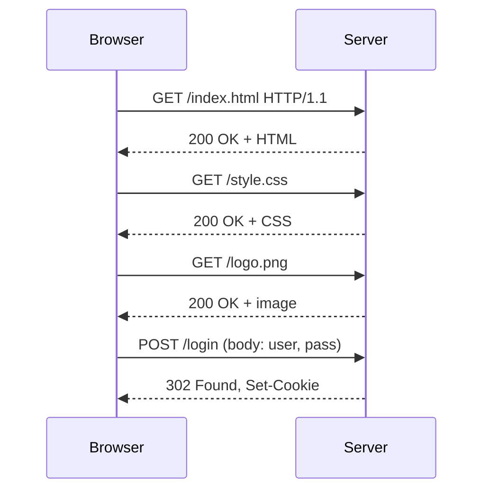

The protocol the whole web rides on. Request, response, stateless.

```
   Browser                         Web Server
      │                                │
      │  GET /search?q=BIPM HTTP/1.1   │
      ├───────────────────────────────►│
      │  Host: example.com             │
      │                                │
      │  HTTP/1.1 200 OK               │
      │◄───────────────────────────────┤
      │  Content-Type: text/html       │
      │                                │
      │  <html>...</html>              │
      │                                │
```

## Anatomy of a request
```
GET /search?q=BIPM HTTP/1.1     ◄── method, path, version
Host: example.com               ◄── headers
Accept: text/html
User-Agent: Mozilla/5.0
                                ◄── blank line, then body (POST/PUT)
```

## GET vs POST
| | GET | POST |
|---|---|---|
| Data goes in | URL query string | request body |
| Values | ASCII only | any bytes |
| Length cap | ~2048 chars URL | none |
| Cacheable | yes | no |
| Bookmarkable | yes | no |
| Reload | safe (idempotent) | resubmits |
| Typical use | read | write, submit form |

! Search forms often use GET so URLs are shareable. Login forms use POST so passwords don't sit in browser history.

## HTTP methods
| Method | Meaning | Idempotent |
|---|---|---|
| GET | read | yes |
| POST | create or trigger | no |
| PUT | replace | yes |
| PATCH | partial update | no |
| DELETE | remove | yes |
| HEAD | metadata only | yes |
| OPTIONS | what's allowed | yes |

## Status code families
| Range | Meaning | Example |
|---|---|---|
| 1xx | informational | 100 Continue |
| 2xx | success | 200 OK, 201 Created |
| 3xx | redirect | 301 Moved, 304 Not Modified |
| 4xx | client error | 404 Not Found, 401 Unauthorized |
| 5xx | server error | 500 Internal, 503 Unavailable |

## HTTPS = HTTP over TLS
- encrypts the channel between browser and server.
- key exchange via Diffie Hellman (public key). Then symmetric key for bulk traffic.
- needs an SSL/TLS certificate. Free from [Let's Encrypt](https://letsencrypt.org/).
- port 443 (vs 80 for plain HTTP).
- defends against: eavesdropping, tampering, impersonation.

```
   Browser ──── TLS handshake ───► Server
       ├── ClientHello (ciphers)
       │◄── ServerHello + cert
       ├── verify cert with CA
       ├── key exchange (DH)
       │◄── encrypted from here on
       └── HTTP requests over encrypted tunnel
```

## Visual



Related: [[Internet Protocol Stack]], [[DNS and URL]], [[Web Architecture]], [[Cache]].

## Learn more
- [RFC 9110 - HTTP Semantics](https://datatracker.ietf.org/doc/html/rfc9110)
- [MDN HTTP docs](https://developer.mozilla.org/en-US/docs/Web/HTTP)
- [What happens when you type a URL (classic Q)](https://github.com/alex/what-happens-when)
