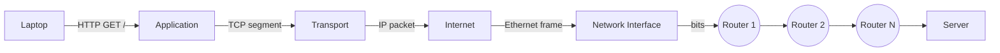
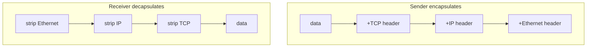

How a packet gets from your laptop to a server. Four layers, each one wraps the next.

```
   ┌──────────────────────────────┐ Application
   │ HTTP, SSH, POP, SMTP, DNS    │ ◄── what humans build
   ├──────────────────────────────┤ Transport
   │ TCP, UDP                     │ ◄── reliability, ports
   ├──────────────────────────────┤ Internet
   │ IP address                   │ ◄── routing across networks
   ├──────────────────────────────┤ Network Interface
   │ Ethernet, Wi-Fi, 5G, DSL     │ ◄── bits on a wire
   └──────────────────────────────┘
```

## The four layers
| Layer | Job | Examples |
|---|---|---|
| Application | what you actually want to do | HTTP, SSH, SMTP, [[DNS and URL\|DNS]] |
| Transport | reliability, multiplexing | TCP (reliable), UDP (fast) |
| Internet | addresses + routing | IP (IPv4 / IPv6) |
| Network Interface | physical transmission | Ethernet, Wi-Fi, 5G |

Each layer adds a header. Receiver peels them off in reverse.

## TCP vs UDP
| | TCP | UDP |
|---|---|---|
| Reliable | yes (resend lost packets) | no |
| Ordered | yes | no |
| Connection | handshake first | fire and forget |
| Use | web, ssh, db | DNS, video, games |

## Ports
- 16-bit number (0 - 65,535) that identifies a service on a host.
- one IP, many ports = many services side by side.
- well-known ports (0 - 1023):

| Service | Port |
|---|---|
| HTTP | 80 |
| HTTPS | 443 |
| SSH | 22 |
| DNS | 53 |
| SMTP | 25 |
| PostgreSQL | 5432 |
| MySQL | 3306 |
| Jupyter | 8888 |

! Higher ports (1024+) are unofficial. Tools grab whatever they want. Conflict = first one wins.

## Firewall
- monitors and controls network traffic.
- runs on a single host (endpoint firewall) or a subnet (DMZ).
- types:
  - **packet filter** by TCP/IP + port (simple, fast)
  - **stateful** tracks connections, allows replies
  - **deep packet inspection** looks inside the payload

```
   internet                firewall              internal net
       │                       │                       │
   ───►│  pkt: dst=10.0.0.5    │  port 22? deny        │
       │                       │  port 443? allow ────►│
       │                       │
```

## traceroute
- shows the hops a packet takes.
- `traceroute 130.216.159.127` -> list of routers along the path.
- each hop = one router = one TTL decrement.

## Visual





Related: [[DNS and URL]], [[HTTP]], [[Load Balancer]].

## Learn more
- [RFC 1122 - Requirements for Internet Hosts](https://datatracker.ietf.org/doc/html/rfc1122)
- [IANA port number registry](https://www.iana.org/assignments/service-names-port-numbers/service-names-port-numbers.xhtml)
- [List of TCP and UDP port numbers (Wikipedia)](https://en.wikipedia.org/wiki/List_of_TCP_and_UDP_port_numbers)
