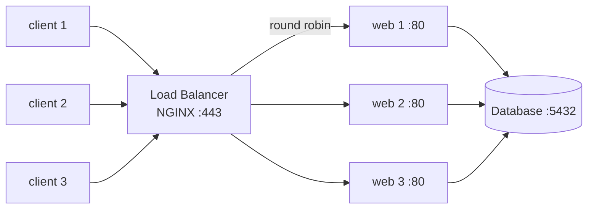
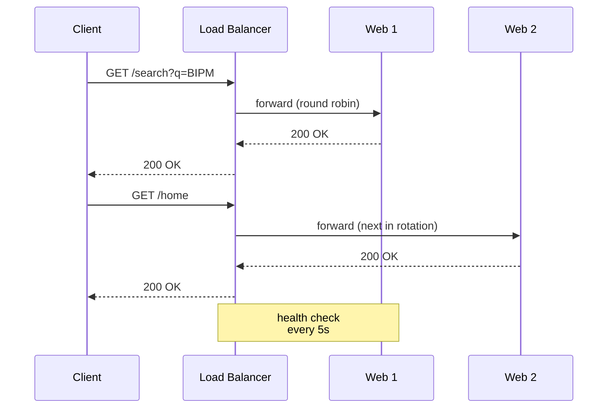

Sits in front of a pool of servers, spreads incoming requests, fails over when a server dies. The "front door" of a scaled web app.

```
                              ┌─► web server 1
   client ─► LOAD BALANCER ───┼─► web server 2 ───► database
   :443         :80           ├─► web server 3
                              └─► web server N
                              ▲
                              health checks, sticky sessions, TLS termination
```

## Proxy types
| Type | Direction | Use |
|---|---|---|
| **Forward proxy** | client side | corporate filter, VPN, anonymizer |
| **Reverse proxy** | server side | hide backend, TLS, [[Cache\|cache]], LB |
| **Load balancer** | server side, multi-backend | distribute load |

A load balancer is a reverse proxy with extra logic.

## Where the balancing happens
- **Server-side** - dedicated LB box (NGINX, HAProxy, AWS ALB). Client talks to LB, LB picks backend.
- **DNS** - DNS returns different IPs per query. Cheap, but slow failover (TTL).
- **Client-side** - client library knows the pool. Used by gRPC, Cassandra clients.

## Strategies
| Strategy | How | When |
|---|---|---|
| **Round-robin** | rotate through servers | uniform, stateless requests |
| **Least connections** | send to least-busy server | uneven request cost |
| **Least load** | check actual CPU/RAM | heterogeneous backends |
| **IP hash** | hash(client IP) -> server | sticky sessions without cookies |
| **Weighted** | bigger servers get more | mixed hardware |

## Health checks
- LB pings each backend every few seconds (TCP, HTTP, custom endpoint).
- failures = drop server from pool. Recoveries = add back.
- prevents sending traffic to a dead box.

## Beyond balancing
A modern LB also does:
- TLS termination (decrypt at LB, plain HTTP to backends)
- HTTP/2 + HTTP/3 upgrade
- compression, content rewriting
- rate limiting + DDoS shield
- request routing by URL path

## Visual





Related: [[HTTP]], [[Cache]], [[CDN]], [[Web Architecture]], [[DNS and URL]].

## Learn more
- [NGINX glossary: reverse proxy vs load balancer](https://www.nginx.com/resources/glossary/reverse-proxy-vs-load-balancer/)
- [HAProxy load balancing strategies](https://www.haproxy.com/blog/load-balancing-algorithms)
- [CapRover](https://caprover.com/) - reverse proxy + LB for Docker, easy HTTPS
