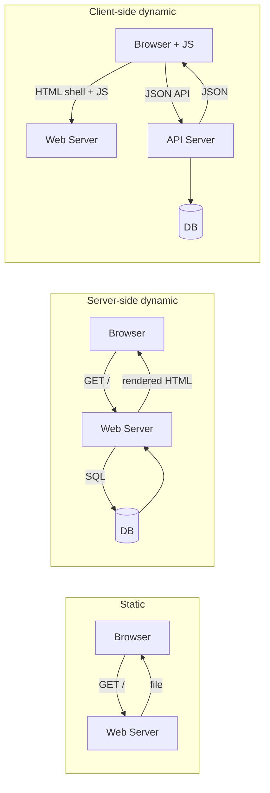

Three patterns for serving a web page: static, server-side dynamic, client-side dynamic. Each adds a layer of complexity.

```
   1. STATIC                 2. SERVER-SIDE DYNAMIC    3. CLIENT-SIDE DYNAMIC
   browser ──► server        browser ──► server        browser
       │       │  HTML           │       │  HTML           │  ──► server (API)
       │       │  (file)         │       │  (rendered)     │      │  JSON
       │       │                 │       │  + DB           │◄─────┘
       │◄──────┘                 │       │     │           │  (JS renders DOM)
                                 │◄──────┴─────┘           │
```

## 1. Static website
- request URL -> server returns a file. Done.
- HTML, CSS, images. No server-side compute. No DB.
- fast, cheap, easy to cache + put on a [[CDN]].
- limit: every visitor sees the same thing.

## 2. Server-side dynamic
- request -> server runs code -> generates HTML on the fly -> sends back.
- code reads from a database (port 5432 for PostgreSQL).
- template engines: Jinja (Python), ERB (Ruby), Blade (PHP).
- examples: classic Django, Rails, WordPress.

```
   browser ──GET /─► web server ──SQL──► database
                       │
                       │ Jinja render
                       ▼
                    HTML ─────────────► browser
```

## 3. Client-side dynamic (SPA)
- server sends a tiny HTML shell + JS bundle.
- JS runs in the browser, fetches JSON from API, mutates DOM.
- frameworks: React, Vue, Svelte, Angular.
- see [[Frontend]] for the full pattern.

## Web frameworks by language
| Language | Frameworks |
|---|---|
| Python | Django, Flask, FastAPI |
| Ruby | Ruby on Rails |
| PHP | Laravel |
| JavaScript | Node.js, Express, Next.js |
| Java | Spring, JSF |

Python users in the wild: Netflix, Google, YouTube, Instagram, Uber, Pinterest, Dropbox, Reddit, Quora, Spotify.

## Where does it RUN: VPS
- **V**irtual **P**rivate **S**erver. Rented Linux box in someone's datacenter.
- multi-tenant: one physical machine runs many VPSs via virtualization.
- full root access via SSH.
- providers: Hetzner Cloud, DigitalOcean Droplets, Amazon Lightsail, EC2, Azure VMs, GCE.
- cost: from €5-10/month.

## Cloud service tiers
```
   you manage less ──────────────────────────────────────► you manage more
   ┌─────┐      ┌─────┐      ┌─────┐
   │ SaaS │     │ PaaS │     │ IaaS │
   ├─────┤      ├─────┤      ├─────┤
   │ app  │     │ app  │     │ app  │  ◄── you
   │ ─── │     │ ─── │      │ ─── │
   │runtime│    │runtime│    │runtime│ ◄── you (IaaS) / provider (PaaS, SaaS)
   │  OS  │     │  OS  │     │  OS  │
   │  hw  │     │  hw  │     │  hw  │
   └─────┘      └─────┘      └─────┘
   Gmail        Heroku       EC2, VPS
```
See [[Cloud]] for details.

## Visual



Related: [[HTTP]], [[Cache]], [[Load Balancer]], [[Frontend]], [[Cloud]].

## Learn more
- [Server-side vs client-side rendering (web.dev)](https://web.dev/rendering-on-the-web/)
- [Two Scoops of Django](https://www.feldroy.com/products/two-scoops-of-django-3-x)
- [Jinja docs](https://palletsprojects.com/p/jinja/)
