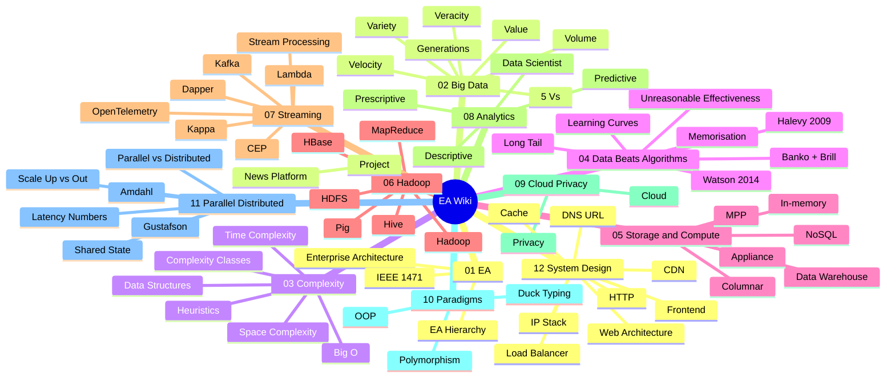

Map of content. Whole wiki at a glance.

```
   ┌─ Enterprise Architecture ──┐
   │                            │
   ▼                            ▼
 Big Data ──► Complexity ──► Data > Algorithms
   │              │                │
   ▼              ▼                ▼
 Storage ──► MapReduce ──► Streaming ──► Analytics
                                  │
                                  ▼
                              Cloud + Privacy
                                  │
                                  ▼
                Parallel/Distributed + System Design

       "structure with a vision" — IEEE 1471
```

> [!NOTE] How to use
> Each link below opens a focused note. Internal `[[wikilinks]]` connect ideas. Follow them like a choose your own adventure of Big Data.

## 01 - Enterprise Architecture
Top of the stack. Why this course exists.

- [[Enterprise Architecture]] - bridge between business and IT
- [[EA Hierarchy]] - mission, process, data, application, technology
- [[IEEE 1471]] - the canonical architecture definition

## 02 - Big Data
What counts as "big" and why we care.

- [[Big Data]] - two definitions, one buzzword
- [[5 Vs]] - the OG framework
- [[Volume]] - GB to PB to ZB
- [[Velocity]] - rate of arrival, streams, peaks
- [[Variety]] - structured, semi structured, unstructured
- [[Veracity]] - can you trust the data
- [[Value]] - the only V that pays the bills
- [[Generations of Data Management]] - DSS to warehouse to real time to Big Data

## 03 - Complexity
Algorithmic efficiency. Scale lives here.

- [[Time Complexity]] - how runtime scales with n
- [[Space Complexity]] - how memory scales with n
- [[Big O]] - the asymptotic ruler
- [[Complexity Classes]] - O(1) to O(n!)
- [[Data Structures]] - arrays, dicts, lists, stacks, queues, BSTs
- [[Heuristics]] - when brute force is impossible

## 04 - Data Beats Algorithms
The intellectual spine of the course.

- [[Unreasonable Effectiveness of Data]] - the thesis
- [[Banko and Brill]] - 2001, log linear curves to 1B words
- [[Halevy Norvig Pereira]] - 2009, Google, web scale
- [[Learning Curves]] - more data, no asymptote
- [[Memorization vs Generalization]] - n grams beat grammars
- [[Long Tail]] - rare events are collectively frequent

## 05 - Storage and Compute
The platforms underneath everything.

- [[MPP]] - massively parallel processing, the foundation
- [[In-memory]] - 10x to 1000x faster than disk
- [[Columnar Database]] - flip rows, win at analytics
- [[NoSQL]] - schemaless, scale out, eventually consistent
- [[Data Warehouse]] - squeaky clean structured data
- [[Data Mart Appliance]] - hw + sw + storage in a box

## 06 - Hadoop and MapReduce
The OG Big Data stack.

- [[Hadoop]] - Doug Cutting, named after a stuffed elephant
- [[HDFS]] - distributed file system, no data model
- [[MapReduce]] - split, map, shuffle, reduce
- [[Hive]] - SQL on Hadoop
- [[HBase]] - distributed columnar store
- [[Pig]] - high level MapReduce

## 07 - Streaming
Real time data. The course technology for our project.

- [[Stream Processing]] - one source, continuous
- [[CEP]] - complex event processing, many sources
- [[Kafka]] - the log as substrate
- [[Lambda Architecture]] - batch + speed layer
- [[Kappa Architecture]] - just stream, replay log
- [[OpenTelemetry]] - traces, metrics, logs unified
- [[Dapper]] - Google's tracing paper, OTel's ancestor

## 08 - Analytics
What you do with the data once you have it.

- [[Descriptive Analytics]] - what happened (rear view mirror)
- [[Predictive Analytics]] - what will happen (windshield)
- [[Prescriptive Analytics]] - what should we do (GPS)
- [[Data Scientist]] - the unicorn role

## 09 - Cloud and Privacy
Where it runs and why people get uncomfortable.

- [[Cloud]] - SaaS, PaaS, IaaS
- [[Privacy]] - intrusion, fraud, profiling

## 10 - Programming Paradigms
The dev side of the course.

- [[Object-Oriented Programming]] - state + methods
- [[Polymorphism]] - same interface, different behavior
- [[Duck Typing]] - if it walks like a duck...

## 11 - Parallel and Distributed Processing
The physics under Big Data. Why one big box hits a wall.

- [[Parallel vs Distributed]] - same node vs many nodes
- [[Scale Up vs Scale Out]] - shared everything, shared disk, shared nothing
- [[Latency Numbers]] - Jeff Dean's table, why memory beats disk
- [[Amdahl's Law]] - pessimistic ceiling on speedup, 1967
- [[Gustafson's Law]] - optimistic counter, fix time not problem, 1988
- [[Shared State]] - locks, deadlock, pure functions

## 12 - System Design
How a request becomes a page. The bones of every web app.

- [[Internet Protocol Stack]] - HTTP/TCP/IP/Ethernet, ports, firewall
- [[DNS and URL]] - names to IPs, anatomy of a web address
- [[HTTP]] - GET/POST, status codes, HTTPS
- [[Web Architecture]] - static vs server-side vs SPA, VPS, frameworks
- [[Cache]] - Memcached, Redis, cache-aside, invalidation
- [[Load Balancer]] - reverse proxy, NGINX, strategies
- [[CDN]] - edge cache near user, Cloudflare/Akamai
- [[Frontend]] - HTML/CSS/JS, DOM, SPA, mobile apps

## Project
The team project this course is graded on.

- [[Talking points may 8]] - news intelligence platform pitch
- [[News Intelligence Platform]] - 5 countries, GDELT + RSS

## Source PDFs
- `1 Intro.pdf` - course intro, EA, Big Data, 5 Vs
- `2 Time and Space Efficiency of Algorithms Slides.pdf` - complexity
- `3 Programming Paradigms.pdf` - OOP, functional
- `4 Parallel and Distributed Processing.pdf` - Amdahl, shared nothing, latency
- `5 System Design.pdf` - HTTP, DNS, cache, load balancer, frontend
- `Banko and Brill - 2001 - ...pdf` - more data beats sophistication
- `GustafsonJ_1988_Reevaluating Amdahls law.pdf` - scaled speedup counter to Amdahl
- `Halevy et al_2009_The unreasonable effectiveness of data.pdf` - web scale data
- `Watson_2014_Tutorial.pdf` - Big Data analytics tour
- `bigdata_requirements.pdf` - course requirements
- `dev_stack_course_en.pdf` - separate dev infrastructure mini-course (Git, VPS, Docker, CapRover, Streamlit)

## Resources folder
Structured takeaways under `../resources/`. Longer prose, headings, paired with marimo notebooks under `../notebooks/`.

---

## Mental model - data flows

```
[raw events]
     ↓ ingest (Kafka, dlt, APIs, RSS)
[log / stream]
     ↓ stream processing (Flink, KSQL, OTel collector)
[enriched events]
     ↓ split
   ┌──────────────────────┬──────────────────────┐
   ▼                      ▼                      ▼
[warehouse]          [data lake]             [serve / dashboard]
 SQL, OLAP            HDFS, S3                low latency reads
   │                      │                      │
   └──── analytics ───────┴──────────────────────┘
         descriptive → predictive → prescriptive
```

Why this shape? See [[Generations of Data Management]] (Watson 2014) and [[Kappa Architecture]] (Kreps 2014).

## Why "more data beats algorithms"
```
accuracy  ▲
          │              ╭──── still climbing at 1B words
          │           ╭──╯     (Banko + Brill, 2001)
          │        ╭──╯
          │     ╭──╯
          │  ╭──╯
          │──╯
          └────────────────────►  log(training size)
```
The course argument in one chart. Every Big Data tech downstream exists to feed that climb. See [[Learning Curves]].

## Visual - the whole wiki at a glance



