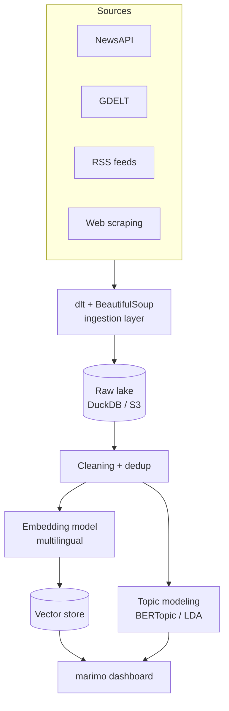
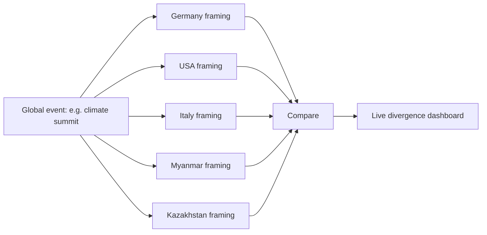
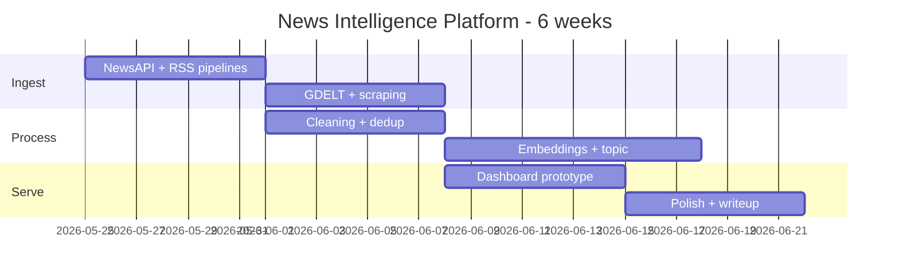

Team project. Global news intelligence platform.

## Pitch
Real time intelligence system that:
- collects news from multiple countries
- classifies (topic, sentiment, framing)
- visualises differences in how countries report the SAME global events

Goal: break away from mindless scrolling. Live dashboard that surfaces narrative divergence.

## Starting countries
- Germany
- USA
- Italy
- Myanmar
- Kazakhstan

! The Myanmar + Kazakhstan picks are the interesting ones. They're the [[Long Tail]] of global news coverage. Capturing them is the differentiation vs an "EU + US" project.

## Ingestion
Two methods:
- **Free APIs** via [dlt](https://dlthub.com)
- **Web scraping + RSS** via BeautifulSoup

## Expected schema (post processing)
```
source
country_target
title
summary
url
published_at
extracted_at
```

## Scale estimate
- 6 week project window
- 126k - 294k records
- 2-5 KB text per record
- ~300 MB - 1.5 GB raw text
- plus embedding vectors

That's [[Volume]] = small. [[Velocity]] = medium (steady ingestion). [[Variety]] = high (every country, every outlet has its own format).

## Course tech used
- [[Stream Processing]] (ingestion) - the required course technology
- [[NoSQL]] or warehouse for storage (DuckDB / S3 likely)
- ML / embeddings for classification
- [[Descriptive Analytics]] dashboard

## Open questions
- topic modelling: BERTopic? LDA?
- embedding model for cross language similarity?
- how to compare narratives quantitatively (sentiment alone is not enough)?
- entity linking across languages?

See [[Talking points may 8]] for the original pitch document.

## Visual - architecture sketch



## Visual - countries + narratives



## Visual - 6-week timeline



## Learn more
- [dlt docs](https://dlthub.com/docs)
- [GDELT Project](https://www.gdeltproject.org/)
- [BERTopic](https://maartengr.github.io/BERTopic/) - the cool topic modelling library
- [marimo](https://marimo.io/) - reactive notebook for the dashboard
- [Sentence Transformers](https://www.sbert.net/) - multilingual embeddings

